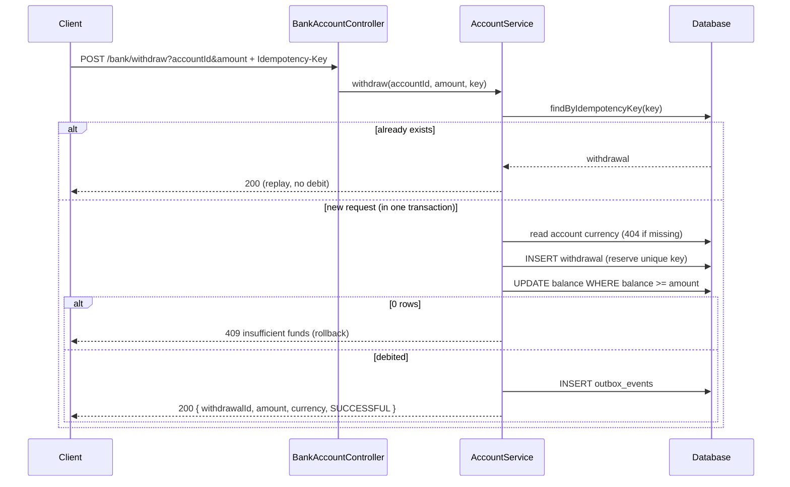
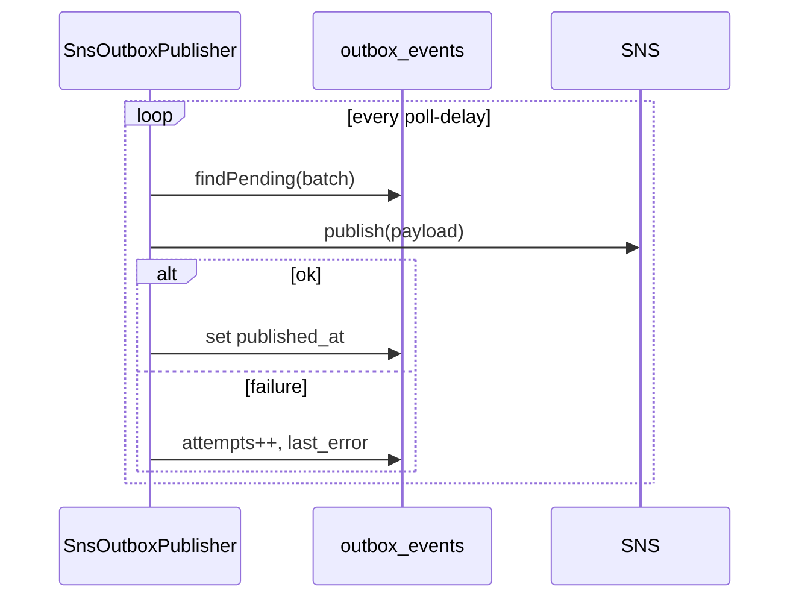

# Architecture, data and flow

How the withdrawal service is put together, what the data looks like, how a request moves through it,
and the metrics I'd add to run it in production.

## Components

```
HTTP ─▶ BankAccountController ─▶ AccountService ─▶ AccountRepository     (accounts: read currency, atomic debit)
                                       │           WithdrawalRepository  (idempotency + durable record)
                                       │           OutboxRepository      (event, same transaction)
                                       ▼
                                  H2 / PostgreSQL
                                       ▲
                    SnsOutboxPublisher ─┘ (scheduled, drains outbox → SNS, off by default)
```

- **api** — `BankAccountController` (HTTP), `WithdrawalResponse`, `ApiExceptionHandler` (maps domain
  errors to status codes).
- **application** — `AccountService`: the use case and the transaction boundary.
- **domain** — `Withdrawal`, `WithdrawalEvent`, `WithdrawalStatus`, `OutboxEvent`, and the
  `AccountNotFoundException` / `InsufficientFundsException` exceptions.
- **infrastructure** — the three repositories (plain SQL via `JdbcClient`) and `SnsOutboxPublisher`.
- **config** — `SanlamBankProperties` (region, topic ARN, outbox settings) and the beans
  (`SnsClient`, `Clock`, `TransactionTemplate`).

## Data model

Three tables (`src/main/resources/schema.sql`).

**accounts** — the balance being protected.

| column | type | notes |
|--------|------|-------|
| id | BIGINT PK | |
| balance | NUMERIC(19,2) | `CHECK (balance >= 0)` |
| currency | CHAR(3) | the account's own currency |
| version | BIGINT | bumped on each debit; room for optimistic locking later |
| updated_at | TIMESTAMP | |

**withdrawals** — the durable record, and the idempotency guard.

| column | type | notes |
|--------|------|-------|
| id | UUID PK | returned to the caller as `withdrawalId` |
| account_id | BIGINT FK | |
| amount | NUMERIC(19,2) | `CHECK (amount > 0)` |
| currency | CHAR(3) | copied from the account |
| status | VARCHAR | `SUCCESSFUL` |
| idempotency_key | VARCHAR **UNIQUE** | the source of truth for "already done" |
| created_at | TIMESTAMP | |

**outbox_events** — events waiting to reach SNS.

| column | type | notes |
|--------|------|-------|
| id | UUID PK | the event id; consumers dedupe on it |
| aggregate_type / aggregate_id | VARCHAR | `Withdrawal` / the withdrawal id |
| event_type | VARCHAR | `WithdrawalSucceeded` |
| payload | TEXT | the JSON event |
| created_at | TIMESTAMP | |
| published_at | TIMESTAMP NULL | set once SNS accepts it |
| attempts | INT | incremented on each failed publish |
| last_error | VARCHAR NULL | last failure reason |
| dead_lettered_at | TIMESTAMP NULL | reserved; not populated yet |

## Request flow



The whole `else` block is one transaction, so a withdrawal and its event commit together or not at all.

### Idempotency under concurrency

The key is inserted **before** the debit. Two simultaneous requests with the same key therefore race
on the unique index, not the account row:

- The winner inserts, debits, commits.
- The loser's insert blocks on the unique key, then fails with `DuplicateKeyException` **before it
  debits anything**. `AccountService` catches that outside the transaction, re-reads by key, and
  returns the winner's result.

So a duplicate is a true replay — exactly-once debit, never a spurious 409. See `DECISIONS.md` §2–3.

## Outbox publishing

`SnsOutboxPublisher` is `@Scheduled` and gated by `withdrawal.outbox.publisher-enabled` (off by
default, so the app runs with no AWS credentials). Each cycle it reads the oldest unpublished rows,
publishes each to SNS, and stamps `published_at`. A publish failure just increments `attempts` and
leaves the row pending for the next cycle — a transient SNS outage never rolls back a committed
withdrawal. Bounded retries + dead-lettering (`dead_lettered_at`) are the documented next step.



## Failure behaviour

| Failure | Result |
|---------|--------|
| Insufficient funds | debit updates 0 rows → 409, transaction rolls back (no withdrawal, no event) |
| Unknown account | 404 before any write |
| Duplicate idempotency key | replay the stored withdrawal, no second debit |
| SNS down | withdrawal still commits; event stays pending and retries |
| App crash mid-request | uncommitted transaction rolls back cleanly; nothing half-applied |

## Metrics worth adding

None are wired in yet (kept the exercise focused), but this is where I'd start. Add
`spring-boot-starter-actuator` + a Micrometer registry (e.g. Prometheus), inject `MeterRegistry`, and
record:

**Business**
- `withdrawal.requests` counter, tagged `outcome = success | replay | insufficient_funds | not_found | invalid`
- `withdrawal.amount` distribution summary (spot unusual sizes)
- `withdrawal.latency` timer on the service call

**Outbox / eventing** (the operational blind spot if unmonitored)
- `outbox.pending` gauge — unpublished rows; should hover near zero
- `outbox.oldest_pending_age_seconds` gauge — the real "are events flowing" signal; alert if it climbs
- `outbox.published` / `outbox.publish_failures` counters
- `outbox.publish.latency` timer

**Free from the platform** (with actuator)
- `http.server.requests` (rate, latency, status per endpoint)
- Hikari pool usage, JVM, GC

Two alerts carry most of the value: **oldest pending outbox age** (events not reaching SNS) and the
**insufficient-funds / error rate** (a spike often means an upstream or data problem, not normal traffic).
